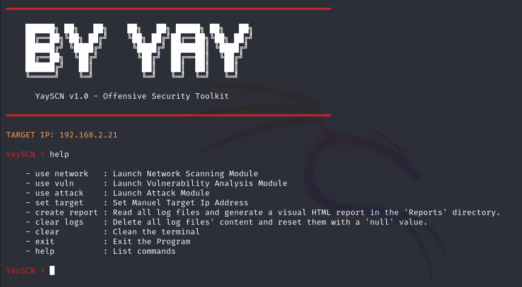
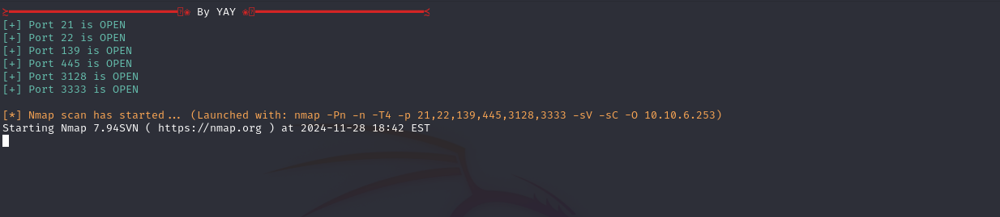
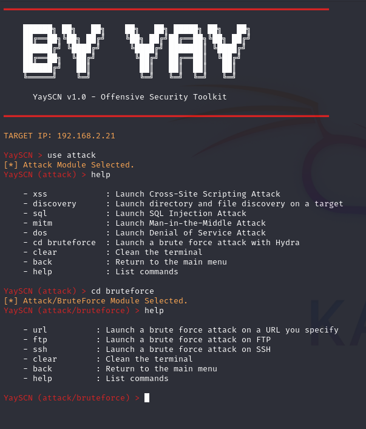
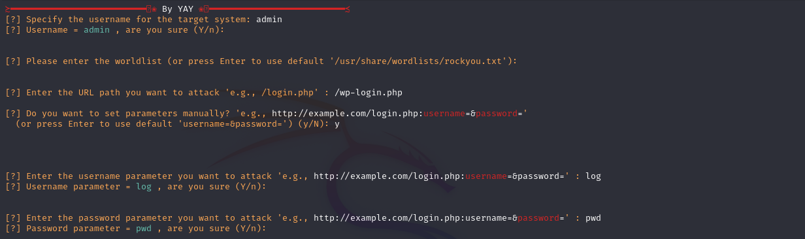
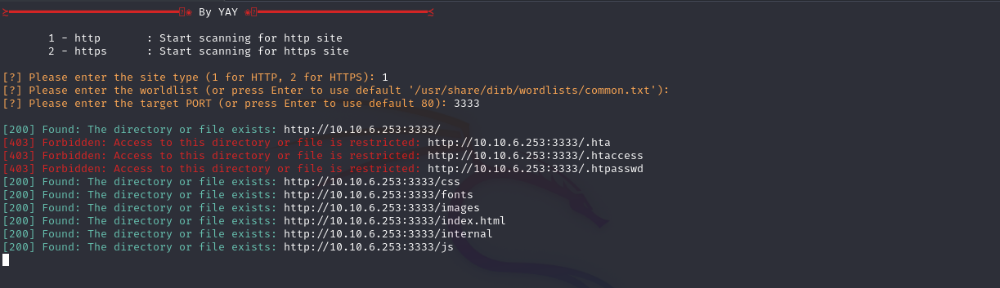
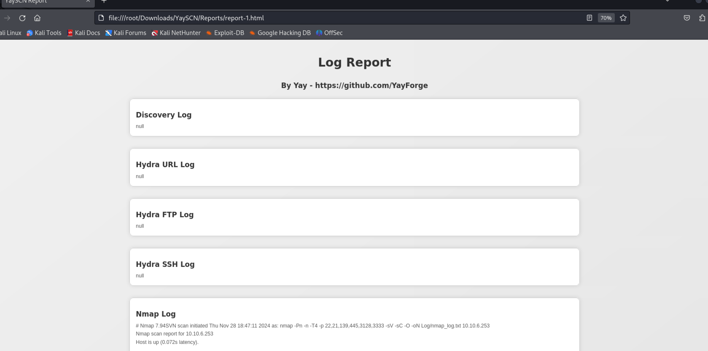

# YaySCN - Offensive Security Toolkit

## 💻 **Menu**

YaySCN is a modular tool designed for penetration testing and network security analysis. It enables security professionals to perform attack simulations and vulnerability assessments efficiently.

---

## 🏗️ **Key Features**
- **Target IP Selection:**  
  Manually select a target IP address and validate it. Automatically scans devices on the same network and allows you to choose a target from the list.
  
- **File Validation:**  
  Ensures all necessary files are present and intact when the project starts, guaranteeing smooth operation.

---

## 🔍 **Modules and Features**

### **1. Network Module**
- Performs **Nmap-based** network scanning to detect open ports and services on the target system.
- Scans devices on the same network, listing their IP addresses and basic details.
- Easily select a target IP address from the generated list.
- Saves all scan results to log files in an organized manner.

## 💫 **Speed**

### **2. Vulnerability Module**
- Analyzes data from network scans to identify potential vulnerabilities.
- Creates a vulnerability map of the target system and logs the results.

### **3. Attack Module**
- **XSS:** Tests for Cross-Site Scripting vulnerabilities in web applications.
- **SQL Injection:** Analyzes the target for SQL injection vulnerabilities.
- **DoS:** Simulates Denial of Service attacks to test service availability.
- **MITM:** Conducts Man-in-the-Middle attack scenarios for analysis.
- **Brute Force:** Attempts password cracking on SSH, FTP, and URL-based services. 

  

  

### **4. Directory Discovery Module**
- Scans the target web server to discover hidden directories and files.
- Uses custom or predefined wordlists for brute-forcing directory paths.
- Logs all discovered directories and their HTTP response codes.
- Provides an organized output for easier analysis.

### **5. Reporting Module**
- Automatically organizes test results and log files into detailed **HTML reports**.

---

## ⚙️ **Inter-Module Integration**
YaySCN modules work seamlessly together. For example, results from network scans are directly passed to the vulnerability analysis module. Target IP information is shared across all modules, supported by a centralized logging system.
